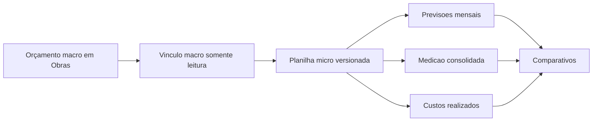
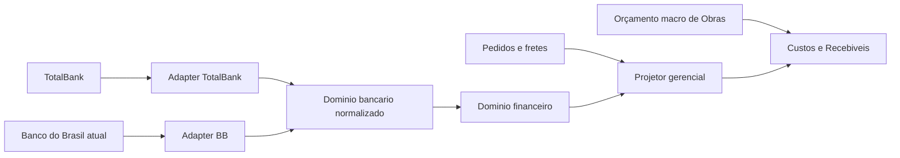

# Plano de implantacao: Custos e Recebiveis + Contas Bancarias

## 1. Decisao estrutural

Este plano cobre dois modulos novos e independentes, integrados por contratos internos do Fluxy:

1. **Custos e Recebiveis**: novo dominio para orçamento micro, planejamento mensal, medicoes, custos realizados e comparativos por obra.
2. **Contas Bancarias**: novo dominio bancario para contas, saldos, extratos, cobrancas, pagamentos, conciliacao e integracoes, iniciando pelo TotalBank.

O modulo **Provisionamento atual permanece intacto**. Nenhuma rota, tabela, menu ou regra existente de Provisionamento sera removida, substituida ou usada como dependencia dos novos modulos nesta implantacao.

O modulo **Obras > Gerenciamento de Obra** continua sendo a fonte do orçamento macro. Custos e Recebiveis referencia essa estrutura, mas armazena uma planilha micro propria, versionada e vinculada a cada linha macro. O novo modulo nao altera automaticamente `valor_orcado`, apropriacao ou estrutura existente de Obras.

O modulo Custos e Recebiveis nao consome a API TotalBank diretamente. Ele le eventos e projecoes normalizados pelo dominio bancario e financeiro do Fluxy.

## 2. Fronteiras dos dominios

| Dominio | Responsabilidade | Nao deve fazer |
| --- | --- | --- |
| Obras | Cadastro da obra, empresa, classificacao e orçamento macro | Armazenar o detalhamento micro mensal do novo modulo |
| Custos e Recebiveis | Planilha micro, previsoes mensais, medicao consolidada, comparativos e obrigacoes | Chamar TotalBank ou editar registros financeiros de origem |
| Financeiro | Titulos, baixas, recebimentos, contas, conciliacoes e DRE | Ser substituido pelo planejamento gerencial |
| Compras | Solicitacoes, cotacoes, pedidos e fretes | Ser tratado como pagamento realizado |
| Contas Bancarias | Provedores, saldos, extratos, webhooks e eventos normalizados | Conceder acesso a obra/empresa por permissao de acao |
| Provisionamento atual | Fluxo legado existente | Ser removido ou reaproveitado implicitamente pelos novos modulos |

## 3. Custos e Recebiveis

**Estado desta fase:** o mockup visual v2 foi aprovado. O contrato detalhado de
fontes, calculos, responsabilidades, escopo e permissoes esta em
`docs/modulos/custos_recebiveis_matriz_fontes_permissoes.md`. As regras de
bloqueio ainda nao estao aprovadas nem ativas.

### 3.1 Inventario funcional obrigatorio do prototipo

O mockup e a implantacao devem cobrir todas as areas observadas no `index (1).html`:

- Dashboard do portfolio e selecao de obra/competencia.
- Cadastro, abertura e edicao do workspace mensal da obra.
- Importacao e reimportacao do orçamento micro.
- Download do modelo de importacao, validacao previa e descarte da importacao.
- Estrutura hierarquica macro/micro com inclusao, edicao, exclusao e versionamento de subitens.
- Assistente mensal para registrar previsao do mes seguinte.
- Previsao de medicao/recebivel por etapa e item micro.
- Previsao de custo por etapa e item micro.
- Revisao, rascunho e finalizacao do planejamento.
- Registro da medicao consolidada da competencia.
- Comparativo entre medicao prevista e consolidada.
- Comparativo entre custo previsto e realizado.
- Custos realizados originados de titulos financeiros e baixas ativas, preservando a solicitacao como origem rastreavel.
- Lista de solicitacoes e titulos vinculados, atualizacao do realizado e reconciliacao controlada.
- Historico mensal, bloqueio da competencia e reabertura controlada pelo ADM.
- Solicitacao de abertura de competencia vencida e decisao auditada.
- Contagem regressiva, alertas e modo de regularizacao.
- Exportacoes independentes de medicao, custo, comparativo, realizado, solicitacoes/titulos e resumo.
- Recarregar demonstracao e apagar dados existem apenas no prototipo; nao entram em producao.

#### 3.1.1 Matriz visual dos 14 PDFs de referencia

Os PDFs formam uma sequencia funcional unica. A implantacao deve preservar a composicao visual compacta do prototipo (menu proprio, tabelas densas, faixas de prazo e assistente em etapas), usando o shell, tipografia, controles e regras de acesso do Fluxy.

| PDF | Tela de referencia | Acoes e controles que precisam existir | Adaptacao correta no Fluxy | Fonte de dados |
| --- | --- | --- | --- | --- |
| 1 | Dashboard do portfolio | `Registrar agora`, abrir comparativo, abrir realizado, prazo mensal e pendencias | Dashboard operacional do modulo, sem botoes de apagar/recarregar demonstracao | Obras, planejamento mensal, medicoes, titulos e baixas |
| 2 | Comparativo por medido previsto | Obra, periodo, base de saldo, indicadores e tabela macro | Base `Medido previsto` selecionavel | Planejamento e estrutura micro consolidada por macro |
| 3 | Comparativo por realizado consolidado | Mesmos filtros, indicadores e tabela | Base `Realizado consolidado` selecionavel | Medicao consolidada, titulos e baixas |
| 4 | Custo realizado | Filtrar, atualizar, abrir origem e visualizar resumo | `Puxar pedidos finalizados` vira `Atualizar realizacoes`; `Simular pedido` vira `Simular solicitacao` | Titulos financeiros e movimentos de baixa ativos; solicitacao apenas como origem |
| 5 | Obras | `Nova obra`, `Abrir`, `Editar` e tabela cadastral | Criacao/edicao continua pertencendo a Obras; o novo modulo apenas abre o workspace financeiro | Cadastro de Obras e empresas |
| 6 | Workspace da obra | `Editar cadastro`, `Reimportar orcamento`, `Novo mes`, `Ver detalhes`, `Registrar consolidada`, `Editar` | Estrutura micro versionada e historico mensal sem sobrescrever o orcamento macro | Obras macro + versoes micro + competencias |
| 7 | Novo mes: medicao | `Cancelar`, competencia, editar quantidades e `Proximo` | Etapa 1 do assistente mensal, com salvamento de rascunho e validacao | Estrutura micro publicada e historico medido |
| 8 | Novo mes: custo | Adicionar subitem, voltar e finalizar | Etapa 2; finalizacao idempotente e auditada | Estrutura micro e previsao de custo |
| 9 | Detalhe da competencia | Abas de medicao prevista, custo previsto, consolidada e realizado | Modal/detalhe somente leitura por padrao, com edicao permissionada | Snapshot da competencia |
| 10 | Custo previsto | Tabela micro por fase e totais | Aba do detalhe mensal | Planejamento de custo |
| 11 | Medicao consolidada | Quantidades e valores consolidados | Aba do detalhe mensal; consolidacao exige permissao propria | Medicao consolidada |
| 12 | Custo realizado | Indicadores, tabela de origem e valores | `Pedidos do sistema` vira `Solicitacoes e titulos`; apenas baixa ativa confirma realizado | Financeiro + origem da solicitacao |
| 13 | Importacoes | Obra destino, arquivo, modelo, validar/importar | Importacao cria nova versao micro; nunca altera competencia fechada | Arquivo validado + vinculo macro |
| 14 | Exportacoes | Filtro por obra e exportacoes independentes | Relatorio `Pedidos` vira `Solicitacoes e titulos`; manter CSV/XLSX conforme volume | Snapshots e fontes normalizadas |

#### 3.1.2 Nomenclatura operacional aprovada para o mockup

- `Pedidos` do prototipo = `Solicitacoes e titulos` no Fluxy.
- `Puxar pedidos finalizados` = `Atualizar realizacoes`.
- `Simular pedido` = `Simular solicitacao`.
- `Pedido pago` nao e evidencia financeira suficiente; o realizado depende de titulo e baixa ativa.
- A solicitacao permanece visivel como origem, codigo de referencia e trilha de auditoria.
- Nenhuma acao do novo modulo muda status de solicitacao, pedido de compra ou titulo financeiro.

### 3.2 Relacao macro/micro



Regras:

- Uma linha micro pertence a uma versao do plano e a uma linha macro existente da obra.
- A soma micro pode ser comparada ao orçamento macro, mas nao o sobrescreve automaticamente.
- Divergencias exigem aviso e justificativa; uma futura acao de sincronizacao precisa ser explicita e permissionada.
- Competencias fechadas guardam snapshot dos codigos, descricoes, quantidades e valores usados naquele momento.
- Reimportar uma planilha cria nova versao; nao altera periodos fechados.

### 3.3 Navegacao proposta

Menu principal independente `Custos e Recebiveis`:

1. `Visao geral`
2. `Obras`
3. `Planejamento mensal`
4. `Comparativo`
5. `Custo realizado`
6. `Obrigacoes e prazos`
7. `Importacoes`
8. `Exportacoes`
9. `Configuracoes`

Dentro da obra:

- `Estrutura micro`
- `Registrar competencia`
- `Historico mensal`
- `Comparativos`
- `Realizados e solicitacoes`
- `Auditoria`

### 3.4 Fontes internas

A tabela abaixo e apenas um resumo. A matriz campo a campo e as regras de rateio,
realizado, escopo e auditoria estao em
`docs/modulos/custos_recebiveis_matriz_fontes_permissoes.md`.

| Informacao | Fonte Fluxy | Uso no novo modulo |
| --- | --- | --- |
| Obra, empresa e classificacao | Obras / EmpresaGrupo | Escopo, ownership e tipo publica/privada |
| Orçamento macro | Apropriacoes/orçamento de Obras | Estrutura pai e limite de referencia |
| Solicitacao/pedido de compra | Compras | Origem operacional e comprometido; nao confirma realizado isoladamente |
| Titulo financeiro | Financeiro | Incorrido/faturado |
| Baixa ativa | Financeiro | Pago/recebido |
| Conciliacao | Financeiro/Bancario | Confirmacao de caixa |
| Saldo bancario | Contas Bancarias | Posicao agregada, sujeita a permissao |

### 3.5 Estrutura modular

```text
backend/src/modules/custosRecebiveis/
  controllers/
  services/
  validators/
  policies/
  projections/
  jobs/
  routes.js

frontend/src/modules/custos-recebiveis/
  components/
  pages/
  services/
  hooks/
  permissions.js
```

### 3.6 Persistencia proposta

- `cr_configuracoes`: prazos, calendario, alertas e politica de obrigacao.
- `cr_responsaveis_obra`: usuario, obra, papel, vigencia e substituto.
- `cr_planos_obra`: cabecalho versionado do orçamento micro.
- `cr_plano_macro_vinculos`: referencia da linha macro existente em Obras.
- `cr_plano_itens`: arvore micro com pai, codigo, descricao, unidade, quantidade, custo unitario e total.
- `cr_competencias`: estado mensal (`ABERTA`, `EM_PREENCHIMENTO`, `ENVIADA`, `FECHADA`, `REABERTA`).
- `cr_previsoes_receita`: medicao/recebivel previsto por item e competencia.
- `cr_previsoes_custo`: custo previsto por item e competencia.
- `cr_medicoes_consolidadas`: valor consolidado por item e competencia.
- `cr_realizados`: projecao idempotente de pedido, titulo, baixa e conciliacao.
- `cr_reaberturas`: solicitacao, decisao, motivo, prazo e aprovador.
- `cr_obrigacoes_usuario`: pendencias calculadas para o guard.
- `cr_importacoes`: arquivo, versao, validacao, usuario e resultado.
- `cr_auditoria`: antes/depois, motivo, usuario, origem e correlacao.

### 3.7 Estados operacionais

Indicadores do prototipo:

- `DENTRO_DO_PLANO`
- `ACIMA_DO_PLANO`
- `A_REALIZAR`
- `SEM_PREVISAO`

Estados adicionais de integridade:

- `NAO_MAPEADO`: origem financeira sem item micro correspondente.
- `DADO_DESATUALIZADO`: sincronizacao financeira/bancaria vencida.
- `DIVERGENCIA_MACRO_MICRO`: total micro diverge do macro de referencia.

### 3.8 Obrigacoes e bloqueio global

O bloqueio so pode ser ativado depois de um periodo de observacao e da aprovacao das regras pendentes.

Principios:

- Apenas usuarios explicitamente responsaveis por uma obra ativa podem ser bloqueados.
- A verificacao ocorre no backend e retorna codigo funcional proprio, por exemplo `MONTHLY_REQUIREMENT_PENDING`.
- O usuario bloqueado continua acessando a pendencia, ajuda, perfil e logout.
- SUPERADMIN nao fica preso ao guard.
- Bypass exige aprovador, justificativa e expiracao.
- Falha do TotalBank ou de qualquer integracao nunca bloqueia o usuario.
- Permissao de acao nao altera escopo de obra ou empresa.

Alertas sugeridos: D-7, D-3, D-1 e vencido.

### 3.9 Permissoes granulares

O acesso amplo nao sera concedido automaticamente por setor. `SUPERADMIN` possui
escopo total; Diretoria e usuarios selecionados do Financeiro precisam da
permissao explicita `custos_recebiveis.escopo.todas_obras`. Os demais usuarios
visualizam somente obras vinculadas em `UsuarioObra`. Permissoes de acao nunca
ampliam esse escopo.

- `custos_recebiveis.modulo.acessar`
- `custos_recebiveis.escopo.todas_obras`
- `custos_recebiveis.saldos_bancarios.visualizar`

- `custos_recebiveis.dashboard.visualizar`
- `custos_recebiveis.comparativo.visualizar`
- `custos_recebiveis.obras.visualizar`
- `custos_recebiveis.estrutura_micro.visualizar`
- `custos_recebiveis.estrutura_micro.importar`
- `custos_recebiveis.estrutura_micro.editar`
- `custos_recebiveis.estrutura_micro.publicar_versao`
- `custos_recebiveis.planejamento.visualizar`
- `custos_recebiveis.planejamento.preencher_custos`
- `custos_recebiveis.planejamento.preencher_recebiveis`
- `custos_recebiveis.planejamento.finalizar`
- `custos_recebiveis.planejamento.reabrir`
- `custos_recebiveis.medicao.consolidar`
- `custos_recebiveis.realizados.visualizar`
- `custos_recebiveis.realizados.atualizar`
- `custos_recebiveis.realizados.reconciliar`
- `custos_recebiveis.reabertura.solicitar`
- `custos_recebiveis.reabertura.aprovar`
- `custos_recebiveis.obrigacoes.visualizar`
- `custos_recebiveis.obrigacoes.conceder_bypass`
- `custos_recebiveis.configuracoes.gerenciar`
- `custos_recebiveis.relatorio.exportar`
- `custos_recebiveis.auditoria.visualizar`

Regras de seguranca das permissoes:

- Permissao de acao nunca amplia escopo de obra, empresa, conta ou solicitacao.
- `visualizar` e `atualizar/reconciliar` sao capacidades separadas.
- `Editar cadastro` continua exigindo a permissao existente do modulo Obras; o novo modulo nao replica ownership cadastral.
- `Atualizar realizacoes` apenas reprocessa fontes autorizadas e idempotentes; nao cria baixa nem altera titulo.
- Importar e publicar versao micro sao permissoes distintas para permitir conferencia antes da ativacao.

## 4. Contas Bancarias e TotalBank

### 4.1 Capacidades confirmadas na homologacao

- Usuario gateway criado no portal.
- Base de homologacao: `https://api.totalbank.com.br/hmg-api/`.
- Swagger: `https://api.totalbank.com.br/hmg-api/swagger.html`.
- Token: `POST /rest/token` com `contaAcesso`, `usuario` e `senha`.
- Resposta do token: `token`, `tipo` e `expiracao`.
- Token informado pelo portal com duracao de 5 minutos.
- Webhooks disponiveis no portal: Cobranca, Pagamento, PIX Recebivel, Notificacao Cob, Conciliacao Titulo Liquidado e Conciliacao Titulo Tarifa.
- Webhook de Pagamento permite filtrar convenio, forma de pagamento e meios `GATEWAY`, `REMESSA` e `SITE`.
- Portal oferece callback OAuth 2.0 opcional, enviando `client_id` e `client_secret` e esperando `access_token`.

Endpoints de saldo, conta, extrato, DDA, cobranca, pagamento e comprovante devem ser extraidos do Swagger/contrato e homologados antes de implementacao. O mockup identifica essas capacidades como `a homologar`, sem presumir payloads.

### 4.2 Navegacao proposta

1. `Posicao bancaria`
2. `Contas e vinculos`
3. `Extratos`
4. `Cobrancas e DDA`
5. `PIX recebivel`
6. `Pagamentos`
7. `Folha`
8. `Fornecedores e favorecidos`
9. `Guias`
10. `Conciliacao`
11. `Integracao TotalBank`
12. `Auditoria`

### 4.3 Estrutura modular

```text
backend/src/modules/banking/
  controllers/
  services/
  validators/
  policies/
  jobs/
  webhooks/
  providers/
    totalbank/
    bancoBrasil/
  routes.js

frontend/src/modules/contas-bancarias/
  components/
  pages/
  services/
  hooks/
  permissions.js
```

O fluxo Banco do Brasil permanece funcional e nao e movido na primeira fase.

### 4.4 Seguranca e confiabilidade

- Credenciais apenas em Secrets Manager ou variaveis protegidas por ambiente.
- Token TotalBank em cache por aproximadamente quatro minutos, com renovacao protegida por mutex.
- Webhook responde rapidamente, persiste evento idempotente e processa de forma assincrona.
- Eventos externos precisam de `external_id`, hash do payload, correlacao e estado de processamento.
- Retry com backoff, fila de falhas, reprocessamento manual e trilha de auditoria.
- Confirmar assinatura, segredo, IP allowlist e politica de retry do TotalBank antes de expor webhook.
- Callback OAuth nunca registra `client_secret` em log.
- Polling de reconciliacao deve conferir lacunas mesmo com webhooks ativos.
- `real-time` significa webhooks + conciliacao incremental, sempre com indicador de ultima atualizacao.

### 4.5 Persistencia proposta

- `bank_integrations`: provedor, ambiente, empresa, estado e referencia segura da credencial.
- `bank_external_accounts`: vinculo entre conta externa e `contas_bancarias`.
- `bank_sync_cursors`: cursor por recurso e conta.
- `bank_balance_snapshots`: saldos datados e origem.
- `bank_webhook_configs`: tipo, convenio, forma, canais e estado.
- `bank_webhook_events`: evento, hash, idempotencia, estado e tentativa.
- `bank_external_transactions`: movimento normalizado e vinculo de conciliacao.
- `bank_integration_jobs`: execucao, duracao, contadores e erro sanitizado.
- `bank_dead_letters`: eventos esgotados para diagnostico/replay.

### 4.6 Permissoes granulares

- `contas_bancarias.dashboard.visualizar`
- `contas_bancarias.contas.visualizar_saldos`
- `contas_bancarias.contas.mapear_empresa`
- `contas_bancarias.extratos.visualizar`
- `contas_bancarias.extratos.sincronizar`
- `contas_bancarias.cobrancas.visualizar`
- `contas_bancarias.pix_recebivel.visualizar`
- `contas_bancarias.conciliacao.executar`
- `contas_bancarias.pagamentos.preparar`
- `contas_bancarias.pagamentos.aprovar`
- `contas_bancarias.pagamentos.enviar`
- `contas_bancarias.pagamentos.cancelar`
- `contas_bancarias.folha.operar`
- `contas_bancarias.guias.operar`
- `contas_bancarias.integracao.configurar`
- `contas_bancarias.integracao.reprocessar`
- `contas_bancarias.auditoria.visualizar`
- `contas_bancarias.relatorio.exportar`

Preparar, aprovar e enviar devem ser permissoes separadas. Nenhuma permissao amplia empresa, conta ou obra visivel.

## 5. Contrato entre os modulos



Camadas de valor no Custos e Recebiveis:

- `Previsto`: planejamento mensal do usuario.
- `Comprometido`: pedido fechado com fornecedor.
- `Incorrido`: titulo financeiro criado.
- `Realizado`: baixa ativa; conciliacao indicada separadamente.
- `Recebido`: baixa ativa de titulo a receber.
- `Saldo bancario`: somente resumo autorizado, com origem e atualizacao.

## 6. Fases de execucao

### Fase 0 - Descoberta e contratos

- Congelar o inventario de telas do prototipo.
- Definir campos obrigatorios, prazos, responsaveis e diferencas entre obra publica/privada.
- Extrair matriz de endpoints TotalBank do Swagger.
- Homologar autenticacao e documentar limites.
- Criar feature flags sem alterar menus existentes.

### Fase 1 - Fundacao independente de Custos e Recebiveis

- Models, migrations, permissoes, auditoria e feature flag.
- Vinculo somente leitura com orçamento macro de Obras.
- Planilha micro versionada e importacao validada.
- Nenhum bloqueio global nesta fase.

### Fase 2 - Planejamento e medicao

- Assistente mensal, rascunho, finalizacao e historico.
- Previsao de custo e recebivel.
- Medicao consolidada e comparativo.
- Reabertura controlada.

### Fase 3 - Realizados e pedidos

- Projetores idempotentes de pedidos, titulos, baixas e recebimentos.
- Tela de nao mapeados e reconciliacao manual auditada.
- Exportacoes completas do prototipo.

### Fase 4 - Obrigacoes em observacao

- Alertas, contagem regressiva e painel de pendencias.
- Guard apenas em modo observacao.
- Medir falsos positivos antes de ativar bloqueio.

### Fase 5 - Fundacao bancaria

- Contas externas, vinculos, cursores, jobs e auditoria.
- Dashboard com fontes atuais do Fluxy.
- Adapter TotalBank em homologacao.

### Fase 6 - Saldos, extratos e webhooks

- Sincronizacao incremental e reconciliacao de lacunas.
- Webhooks homologados, replay e dead letter.
- Vinculo conta -> empresa -> obra.
- Alimentacao do read model de Custos e Recebiveis.

### Fase 7 - Operacoes bancarias homologadas

- Habilitar apenas DDA, cobranca, PIX, pagamentos, folha ou guias confirmados no contrato.
- Dupla aprovacao, idempotencia, consulta de status e comprovantes.
- Preservar os fluxos Banco do Brasil existentes.

### Fase 8 - Ativacao gradual do bloqueio

- Piloto com usuarios/obras definidos.
- Bypass auditado.
- Rollback por feature flag.
- Ativacao geral apenas apos aceite operacional.

## 7. Testes obrigatorios

- Provisionamento atual continua funcionando e com a mesma navegacao.
- Orçamento macro em Obras nao e alterado por importacao/edicao micro.
- Reimportacao cria versao sem alterar competencia fechada.
- Usuario com permissao de editar nao ganha visibilidade de outra obra.
- Pedido fechado nao vira pago automaticamente.
- Estorno de baixa corrige projecao sem apagar historico.
- Evento TotalBank duplicado nao duplica saldo, movimento ou realizado.
- Indisponibilidade TotalBank nao bloqueia Fluxy nem obriga usuario a preencher novamente.
- Fluxo Banco do Brasil permanece funcional.
- Guard permite regularizacao, ajuda, perfil e logout.
- Exportacoes respeitam empresa, obra e permissoes.

## 8. Definicoes pendentes com o negocio

1. Quais campos/blocos sao obrigatorios para liberar o acesso: previsao de custo, previsao de recebivel, medicao consolidada, justificativa, anexos ou combinacao.
2. O responsavel preenche sempre o mes seguinte, o consolidado do mes atual ou ambos.
3. Dia/hora limite e regra de fim de semana/feriado.
4. Quem fica bloqueado: responsavel, substituto, gerente ou setor.
5. Quem concede bypass e qual o prazo maximo.
6. Obras sem movimento enviam declaracao de ausencia?
7. Regras diferentes para obra publica e privada.
8. Quem pode publicar nova versao do orçamento micro.
9. Qual evento e o realizado oficial por painel: pedido, titulo, baixa ou conciliacao.
10. Responsaveis de obra podem ver saldo bancario ou apenas Financeiro/Diretoria.
11. Quais endpoints TotalBank estao contratados para saldos, extratos, DDA, PIX, cobranca, pagamento, folha e guias.
12. Como o TotalBank autentica/assina webhooks e quantas tentativas realiza.

## 9. Trilhas operacionais por classificacao da obra

O modulo deve preservar `Obra.classificacao` como discriminador obrigatorio.
`PUBLICA` e `PRIVADA` compartilham custos, planejamento mensal, realizado,
auditoria e obrigacoes, mas possuem fontes e jornadas distintas para receitas.

### 9.1 Nucleo comum

- competencia mensal por obra;
- planejamento micro de custos, sem sobrescrever o orcamento macro de Obras;
- custos previstos, comprometidos e realizados;
- realizado oficial originado em titulos e baixas ativas;
- conciliacao e saldos bancarios como evidencia, sem duplicar o realizado;
- versoes, justificativas, anexos e trilha append-only;
- escopo de obra aplicado antes de consultar, agregar, paginar ou exportar.

### 9.2 Obra publica

- usa planilha micro detalhada e acompanhamento por apropriacao;
- registra previsao de medicao por competencia;
- acompanha medicao prevista, apresentada, aprovada, faturada e recebida;
- vincula medicao aos titulos a receber correspondentes;
- considera realizado somente pelas baixas ativas dos titulos vinculados;
- permite obrigacao mensal de custo previsto e medicao/recebivel previsto.

### 9.3 Obra privada

- nao exibe nem exige medicao;
- usa o planejamento geral existente em Obras como referencia macro somente
  leitura;
- detalha custos no novo planejamento micro mensal;
- forma a previsao de recebiveis a partir de contratos de venda e suas parcelas;
- quando uma parcela possuir titulo a receber, o titulo passa a ser a fonte
  operacional de vencimento, saldo e status;
- considera receita realizada somente pelas baixas ativas dos titulos a receber;
- apresenta carteira, vencimentos, inadimplencia e recebimentos por contrato,
  unidade, cliente e competencia;
- permite revisao/confirmacao mensal da previsao gerada automaticamente, sem
  obrigar o usuario a redigitar contratos e titulos.

### 9.4 Prioridade das fontes e antidupla contagem

1. Parcela de contrato sem titulo: previsao comercial.
2. Parcela com titulo vinculado: o titulo substitui a parcela na previsao
   operacional.
3. Baixa ativa do titulo: realizado financeiro.
4. Movimento TotalBank conciliado com a baixa: evidencia bancaria, sem novo
   lancamento de realizado.
5. Movimento bancario sem conciliacao: pendencia de conciliacao, nunca realizado
   automatico do modulo.

### 9.5 Obrigacoes por classificacao

| Obrigacao | Publica | Privada |
|---|---:|---:|
| Planejamento micro de custos | Sim | Sim |
| Previsao de medicao | Sim | Nao |
| Previsao de recebiveis | Medicao/titulos | Contratos/parcelas/titulos |
| Confirmacao mensal dos recebiveis | Sim | Sim |
| Declaracao de ausencia de movimento | Configuravel | Configuravel |
| Justificativa de desvio | Configuravel | Configuravel |

Nenhuma falha de sincronizacao do TotalBank pode bloquear o usuario. O bloqueio
considera somente obrigacoes manuais atribuiveis ao usuario.

## 10. Escopo de visibilidade e edicao

- `SUPERADMIN` e a permissao explicita
  `custos_recebiveis.escopo.todas_obras` podem ampliar o escopo.
- Os demais usuarios visualizam apenas obras vinculadas pelo mecanismo oficial
  de usuario/obra.
- Usuario sem obra vinculada e sem permissao ampla recebe lista vazia e nao abre
  detalhe por URL.
- Permissoes de criar, editar, consolidar, aprovar, exportar ou auditar nunca
  ampliam visibilidade.
- O backend reaplica escopo em lista, detalhe, dashboard, exportacao, anexos e
  mutacoes; ocultar controles no frontend e apenas uma camada adicional.
- Diretoria e Financeiro podem receber escopo amplo somente por permissao
  explicita, nunca apenas pelo nome do setor.

## 11. Criterios de aceite das duas trilhas

- trocar a classificacao no filtro altera campos e indicadores, nao apenas o
  rotulo da tela;
- obra privada nunca solicita medicao;
- obra publica nao usa contrato de venda como origem de recebivel;
- uma baixa aparece uma unica vez no realizado;
- o total de recebiveis privados pode ser rastreado ate contrato, parcela,
  titulo e baixa;
- o usuario nao acessa obra fora do escopo por URL, exportacao ou agregacao;
- alterar permissao de acao nao modifica o conjunto de obras visiveis.

## 12. Mockup v3 operacional e navegavel

O mockup v3 deixou de ser apenas demonstrativo e passou a simular os principais
fluxos operacionais planejados, sem chamar endpoints reais e sem alterar dados
do sistema.

### 12.1 Acoes comuns

- abrir novo ciclo mensal e registrar previsoes;
- comparar competencias;
- atualizar realizados;
- criar versao de planejamento;
- importar planilha e adicionar linha manual;
- registrar custo previsto e vincular solicitacao;
- consultar conciliacao, obrigacoes, historico e trilha de auditoria;
- exportar a visao atual em CSV.

### 12.2 Obra publica

- registrar previsao mensal de medicao;
- importar e consolidar medicao;
- acompanhar medicao prevista, apresentada, aprovada, faturada e recebida;
- registrar custos previstos e realizados vinculados a obra.

### 12.3 Obra privada

- revisar recebiveis vindos de contratos de venda;
- abrir titulos a receber vinculados;
- gerar acompanhamento mensal;
- registrar cobranca e acompanhar inadimplencia;
- manter realizado baseado em baixas financeiras, sem simular medicao.

### 12.4 Comportamento do prototipo

- botoes abrem modais ou paines correspondentes;
- confirmacoes atualizam o resumo de atividade da tela;
- mensagens de sucesso aparecem por toast;
- exportacoes sao locais e simuladas;
- nenhuma acao persiste no backend;
- permissao e escopo continuam descritos como requisitos obrigatorios do
  backend futuro, sem serem simulados como ampliacao de visibilidade.

O proximo refinamento tecnico deve transformar cada fluxo aprovado em contrato
de API, payload, validacao, permissao e evento de auditoria antes da
implementacao de controllers, services, models e migrations.
