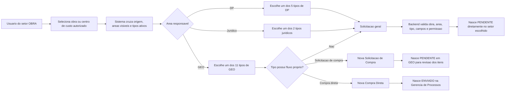
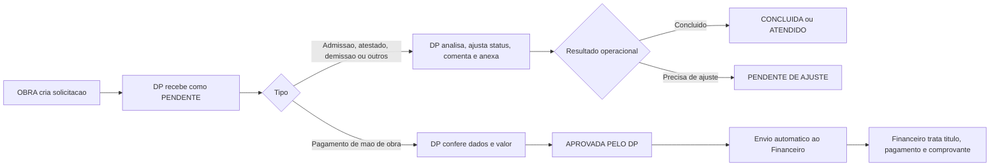
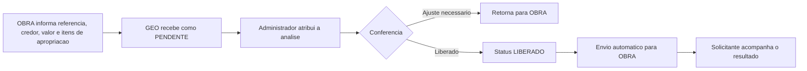
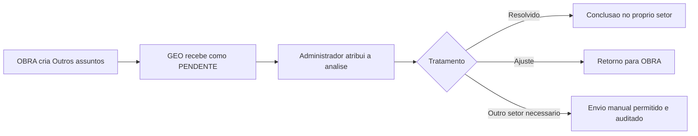
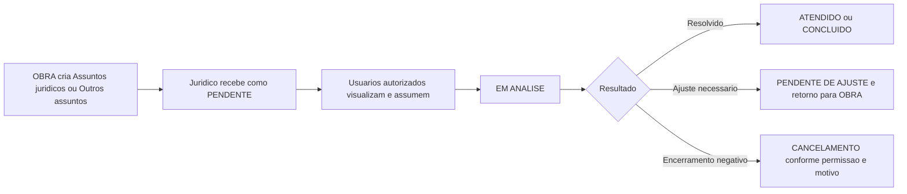
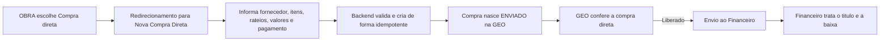
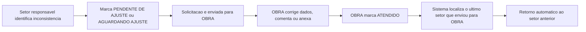

# Fluxos de solicitacoes iniciais do setor OBRA

## Objetivo e fonte

Este documento descreve o que um usuario do setor `OBRA` pode iniciar hoje, para onde cada solicitacao segue e quais campos e automacoes afetam o caminho. Ele e uma fotografia da producao e deve ser atualizado quando as configuracoes administrativas ou as regras de criacao forem alteradas.

Fonte da fotografia:

- ambiente: `production`;
- banco: `gestao_solicitacoes`;
- auditoria gerada em: `2026-08-06T17:40:14.919Z`;
- periodo historico consultado: desde `2024-01-01`;
- solicitacoes historicas analisadas: `4.057`;
- combinacoes vigentes encontradas: `18`;
- SHA-256 do relatorio: `1D6377E7433DD7CDFA27FFC2893583EE8EA1D524EA4BC8ADEFF19B185EBF122F`.

Ordem de autoridade usada neste documento:

1. regras atuais do backend e frontend;
2. configuracoes atuais do banco de producao;
3. historico agregado, usado apenas para validar uso e identificar legado.

O historico nao define sozinho o fluxo vigente. Das 4.057 solicitacoes analisadas, 2.551, ou 62,9%, ainda registram o antigo fluxo de diretoria. Novas solicitacoes nao passam por essa aprovacao.

## Resumo executivo

- o usuario de OBRA escolhe uma obra ou centro de custo ao qual tenha acesso;
- os destinos efetivos atuais sao `DP`, `GEO` e `JURIDICO`;
- existem 18 combinacoes entre destino e tipo, representando 16 tipos distintos;
- solicitacoes gerais nascem diretamente no setor escolhido com status `PENDENTE`;
- `SOLICITACAO DE COMPRA` e `COMPRA DIRETA` saem da tela geral e usam seus fluxos proprios no modulo de Compras;
- nao existe aprovacao previa da diretoria para registros novos;
- automacoes por status so acontecem depois de uma transicao valida no setor responsavel;
- devolucoes para ajuste possuem retorno automatico ao ultimo setor que enviou a solicitacao para OBRA;
- quando OBRA marca `MERCADORIA ENTREGUE`, o sistema envia automaticamente a solicitacao ao Financeiro.

## Como o sistema resolve as opcoes de OBRA

O conjunto exibido ao usuario e a intersecao de tres regras:

1. setores permitidos para a origem `OBRA` em `AREAS_POR_SETOR_ORIGEM`;
2. setores liberados para OBRA em `AREAS_OBRA_VISIVEIS`;
3. tipos ativos e habilitados para cada setor em `TIPOS_SOLICITACAO_POR_SETOR`.

Na producao, `AREAS_POR_SETOR_ORIGEM` inclui `RH`, mas `AREAS_OBRA_VISIVEIS` nao. Por isso, `RH` nao aparece como destino efetivo. O resultado atual e:

| Destino | Nome | Combinacoes | Tipos distintos |
| --- | --- | ---: | ---: |
| `DP` | Departamento Pessoal | 5 | 5 |
| `GEO` | Gerencia de Processos | 11 | 11 |
| `JURIDICO` | Juridico | 2 | 2 |

## Mapa mestre do fluxo vigente



## Matriz completa das combinacoes vigentes

Campos basicos como identificacao do solicitante sao obtidos da sessao. `Anexos` aparecem em todas as combinacoes gerais, mas nao sao obrigatorios na fotografia auditada.

### Departamento Pessoal

| Tipo | Recebimento | Campos obrigatorios | Campos opcionais relevantes | Saida automatica |
| --- | --- | --- | --- | --- |
| Admissao | Todos visiveis | obra, area, valor, vencimento, descricao | credor, anexos | nenhuma |
| Atestado | Todos visiveis | obra, area, valor, vencimento, descricao | credor, anexos | nenhuma |
| Demissao | Todos visiveis | obra, area, valor, vencimento, descricao | credor, data de demissao, anexos | nenhuma |
| Outros assuntos | Todos visiveis | obra, area, vencimento, descricao | credor, anexos | nenhuma |
| Pagamento de mao de obra | Todos visiveis | obra, area, valor, vencimento, descricao | credor, anexos | `APROVADA PELO DP` envia ao Financeiro |

Observacao: a data de demissao esta visivel, mas nao esta configurada como obrigatoria na producao.

### Gerencia de Processos

| Tipo | Recebimento | Entrada | Campos obrigatorios na entrada | Campos opcionais relevantes | Saida automatica |
| --- | --- | --- | --- | --- | --- |
| Abertura de contrato | Admin primeiro | solicitacao geral | obra, area, credor, valor, vencimento, referencia de contrato, itens de apropriacao, descricao | cadastro de credor, anexos | `LIBERADO` devolve para OBRA |
| ADM local de obra | Admin primeiro | solicitacao geral | obra, area, credor, subtipo, contrato, valor, vencimento, descricao | cadastro de credor, rateio do contrato, anexos | `LIBERADO` envia ao Financeiro |
| Compra direta | Todos visiveis | `/solicitacoes-compra-direta/nova` | obra, fornecedor ativo, ao menos um item, rateio, valor dos itens e forma de pagamento ativa | desconto, dados de pagamento, anexos; boleto exige anexo | nasce `ENVIADO` na GEO e segue pelo fluxo proprio |
| Despesa administrativa | Todos visiveis | solicitacao geral | obra, area, credor, valor, vencimento, descricao | cadastro de credor, subtipo, anexos | `LIBERADO` envia ao Financeiro |
| Despesa comercial | Todos visiveis | solicitacao geral | obra, area, valor, vencimento, descricao | credor, anexos | `LIBERADO` envia ao Financeiro |
| Despesas de marketing | Todos visiveis | solicitacao geral | obra, area, valor, vencimento, descricao | credor, anexos | `LIBERADO` envia ao Financeiro |
| Locacao de maquinas e equipamentos | Admin primeiro | solicitacao geral | obra, area, credor, contrato, valor, vencimento, descricao | cadastro de credor, rateio do contrato, anexos | `LIBERADO` envia ao Financeiro |
| Medicao | Admin primeiro | solicitacao geral | obra, area, contrato, rateio do contrato, valor, vencimento, inicio e fim da medicao | credor, descricao, anexos | `LIBERADO` envia ao Financeiro |
| Outros assuntos | Admin primeiro | solicitacao geral | obra, area, vencimento, descricao | credor, cadastro de credor, valor, anexos | nenhuma |
| Recarga de cartao | Admin primeiro | solicitacao geral | obra, area, valor, vencimento, descricao | credor, anexos | `LIBERADO` envia ao Financeiro |
| Solicitacao de compra | Todos visiveis | `/solicitacoes-compra/nova` | obra, ao menos um item, quantidade, unidade, data necessaria e rateio valido | especificacao, link, itens manuais, importacao e anexos | nasce `PENDENTE` em GEO; apos revisao, GEO envia para Compras |

### Juridico

| Tipo | Recebimento | Campos obrigatorios | Campos opcionais relevantes | Saida automatica |
| --- | --- | --- | --- | --- |
| Assuntos juridicos | Todos visiveis | obra, area, valor, vencimento, descricao | credor, anexos | nenhuma |
| Outros assuntos | Todos visiveis | obra, area, vencimento, descricao | credor, anexos | nenhuma |

## Significado do modo de recebimento

`TODOS_VISIVEIS`:

- usuarios autorizados do setor conseguem visualizar a nova solicitacao;
- assumir ou atribuir ainda depende das permissoes do usuario e do setor;
- a solicitacao continua pertencendo ao setor responsavel, e nao ao usuario que a visualizou.

`ADMIN_PRIMEIRO`:

- a notificacao inicial vai para administradores do setor;
- usuario comum do setor nao ve o registro apenas por ele ter chegado ao setor;
- o registro passa a ficar disponivel ao usuario quando foi criado por ele ou quando existe atribuicao/interacao registrada;
- atribuicao continua validada pelo backend.

## Fluxo de Departamento Pessoal



## Fluxos da Gerencia de Processos

### Solicitacoes gerais com efeito financeiro


Esse desenho atende `ADM LOCAL DE OBRA`, `DESPESA ADMINISTRATIVA`, `DESPESA COMERCIAL`, `DESPESAS DE MARKETING`, `LOCACAO DE MAQ. EQ.`, `MEDICAO` e `RECARGA DE CARTAO`. A criacao da solicitacao nao gera titulo automaticamente; o efeito financeiro depende da acao valida no Financeiro.

### Abertura de contrato



### Outros assuntos destinados a GEO



Nao existe automacao de status configurada para `OUTROS ASSUNTOS` em GEO.

## Fluxo juridico



Nao ha automacao de encaminhamento por status para os dois tipos juridicos.

## Fluxos proprios de Compras

### Solicitacao de compra normal

```mermaid
flowchart LR
    A["OBRA escolhe Solicitacao de compra"] --> B["Redirecionamento para Nova Solicitacao de Compra"]
    B --> C["Preenche itens, quantidades, datas e rateios"]
    C --> D["Backend valida e cria de forma idempotente"]
    D --> E["Compra nasce PENDENTE em GEO"]
    E --> F["GEO revisa quantidades e apropriacoes"]
    F --> G["GEO envia para Compras"]
    G --> H["Compra fica LIBERADO PARA COMPRA"]
    H --> I["Delegacao, cotacao, respostas e comparativo"]
    I --> J["Geracao de pedidos ou encerramento sem pedido"]
    J --> K["Entrega total ou parcial para OBRA"]
    K --> L["OBRA registra MERCADORIA ENTREGUE"]
    L --> M["Envio automatico ao Financeiro"]
```



### Compra direta



Os dois fluxos criam uma solicitacao principal vinculada para manter historico, notificacoes e rastreabilidade. Nenhum deles ativa aprovacao previa da diretoria.

## Ciclo comum de ajuste



Essa regra evita que a OBRA tenha de escolher novamente o destino e preserva a trilha do envio original.

## Status atualmente ativos por setor

### DP

- `PENDENTE`;
- `PENDENTE DE PAGAMENTO`;
- `PENDENTE DE AJUSTE`;
- `ERRO NO PAGAMENTO`;
- `DIARISTA`;
- `EM ANALISE`;
- `CONCLUIDA`;
- `ATENDIDO`;
- `APROVADA PELO DP`;
- `COM A CONTABILIDADE`.

### GEO

- `EM ANALISE`;
- `PENDENTE DE AJUSTE`;
- `LIBERADO`;
- `CONCLUIDA`;
- `CANCELADA`.

O registro novo ainda nasce com o status tecnico inicial `PENDENTE`. `CADASTRADO NO ERP LEGADO` e `ERRO NO PAGAMENTO` aparecem cadastrados para GEO, mas estavam inativos na fotografia de producao e nao compoem o fluxo vigente.

### Juridico

- `RECEBIDO`;
- `EM ANALISE`;
- `PENDENTE DE AJUSTE`;
- `ATENDIDO`;
- `CONCLUIDO`;
- `ERRO NO PAGAMENTO`.

## Evidencia historica e legado

O historico agregado encontrou 2.988 assinaturas de caminho diferentes. Essa variedade decorre de anexos, comentarios, atribuicoes, mudancas manuais, pagamentos e dos fluxos antigos. Para documentacao operacional, os caminhos foram consolidados por regra vigente.

| Tipo vigente | Registros historicos | Observacao |
| --- | ---: | --- |
| ADM local de obra | 855 | maior volume; possui caminhos antigos por diretoria e ERP legado |
| Solicitacao de compra | 649 | mistura fluxo antigo e modulo atual de Compras |
| Medicao | 549 | forte presenca de fluxo antigo por diretoria e Financeiro |
| Pagamento de mao de obra | 487 | confirma a passagem DP para Financeiro |
| Compra direta | 451 | historico inclui diretoria; criacao atual vai direto para GEO |
| Outros assuntos | 292 | aparece em mais de um destino; o setor escolhido define o tratamento |
| Locacao de maquinas e equipamentos | 216 | confirma GEO e posterior tratamento financeiro |
| Abertura de contrato | 164 | historico antigo possui `CADASTRADO NO ERP LEGADO`, hoje inativo |
| Demissao | 116 | historico apresenta tratamentos distintos no DP |
| Admissao | 102 | normalmente conclui no DP |
| Recarga de cartao | 69 | confirma GEO e Financeiro |
| Atestado | 66 | normalmente conclui no DP |
| Despesa administrativa | 23 | baixo volume e varios registros cancelados |
| Assuntos juridicos | 4 | baixo volume historico |
| Despesa comercial | 1 | sem base suficiente para inferir caminho pelo historico |
| Despesas de marketing | 0 | combinacao configurada, ainda sem ocorrencia na amostra |

Tambem existem 13 registros historicos do tipo `PRE_OBRA`, que nao faz parte das combinacoes vigentes para OBRA. Eles devem permanecer consultaveis, mas nao devem ser usados para reintroduzir o tipo na tela.

### Elementos exclusivamente legados

Os seguintes elementos aparecem no historico ou em configuracoes de compatibilidade, mas nao definem novas solicitacoes:

- aprovacao previa por `DIR_OBRAS_PUBLICAS` ou `DIR_OBRAS_PRIVADAS`;
- `fluxo_aprovacao_diretoria = true`;
- status `CADASTRADO NO ERP LEGADO`;
- encaminhamento para o ERP legado;
- tipo `PRE_OBRA` fora da configuracao atual.

Registros antigos que ja tenham essas marcas continuam suportados para leitura e conclusao segura.

## Tipos ativos que nao estao disponiveis para OBRA

O cadastro possui tipos ativos usados por outros setores. Eles nao aparecem para OBRA porque nao pertencem a nenhuma das 18 combinacoes efetivas:

- Assistencia medica;
- FGTS;
- Geracao de boletos;
- INSS;
- Outros assuntos financeiros;
- Outros impostos;
- PIS/COFINS;
- Simples Nacional;
- Ticket alimentacao.

A existencia desses tipos no cadastro nao autoriza seu uso por OBRA.

## Dependencias e risco de regressao

Uma alteracao nessa tela ou nesses fluxos precisa considerar simultaneamente:

| Componente | Responsabilidade | Risco se alterado isoladamente |
| --- | --- | --- |
| `AREAS_POR_SETOR_ORIGEM` | limita destinos pela origem do usuario | exibir setor nao autorizado ou ocultar destino valido |
| `AREAS_OBRA_VISIVEIS` | aplica o recorte adicional de OBRA | divergencia entre configuracao e tela |
| `TIPOS_SOLICITACAO_POR_SETOR` | define tipos e modo de recebimento | tipo chegar ao setor errado ou ficar invisivel |
| `NOVA_SOLICITACAO_CAMPOS_POR_TIPO` | define campos visiveis e obrigatorios | gravar solicitacao incompleta ou bloquear caso valido |
| comportamento do tipo | complementa contrato, valor, descricao e medicao | frontend e backend exigirem dados diferentes |
| `NOVA_SOLICITACAO_AUTOMACAO_DESTINO` | redireciona para Compras | criar solicitacao geral duplicada ou ignorar o modulo correto |
| `AUTOMACAO_STATUS_SETOR` | envia depois de status valido | solicitacao ficar parada ou seguir prematuramente |
| status por setor | controla as transicoes disponiveis | impedir conclusao, ajuste ou liberacao |
| escopo da obra | limita obras e centros de custo do usuario | vazamento de dados ou solicitacao na obra errada |
| idempotencia | impede criacao repetida | duplicidade de solicitacao, compra, item ou efeito financeiro |

## Checklist de teste para mudancas futuras

1. entrar como usuario real de OBRA vinculado a uma obra publica e a uma privada;
2. confirmar que somente DP, GEO e Juridico aparecem;
3. validar os 18 pares setor/tipo desta matriz;
4. testar campos obrigatorios e opcionais de cada familia;
5. confirmar que solicitacao geral nasce `PENDENTE` diretamente no setor escolhido;
6. confirmar que o registro novo grava `fluxo_aprovacao_diretoria = false`;
7. testar `ADMIN_PRIMEIRO` com administrador e usuario comum;
8. testar `TODOS_VISIVEIS` com assumir e atribuir conforme permissoes;
9. testar `APROVADA PELO DP` para pagamento de mao de obra;
10. testar `LIBERADO` em cada tipo de GEO e conferir o destino correto;
11. testar solicitacao de compra e compra direta sem criar registro duplicado na tela geral;
12. testar devolucao para ajuste e retorno automatico ao setor anterior;
13. testar `MERCADORIA ENTREGUE` em OBRA e envio ao Financeiro;
14. confirmar que registros antigos de diretoria e ERP legado continuam apenas consultaveis e concluidos com seguranca;
15. conferir historico, notificacoes e eventos em tempo real em cada transicao.

## Pontos de codigo que sustentam este desenho

- `frontend/src/pages/NovaSolicitacao.jsx`: filtro de setores, tipos, campos e redirecionamentos;
- `backend/src/controllers/SolicitacaoController.js`: validacao, criacao direta, status, ajustes e automacoes;
- `backend/src/controllers/SolicitacaoCompraController.js`: criacao normal e direta de Compras;
- `backend/src/services/tipoSolicitacaoBehaviorService.js`: comportamento dos tipos;
- `backend/src/services/novaSolicitacaoCamposConfig.js`: resolucao dos campos;
- `backend/src/services/novaSolicitacaoAutomacaoDestinoConfig.js`: destino especial para Compras;
- `backend/scripts/auditarFluxosSolicitacoesObra.js`: geracao read-only da fotografia operacional.

## Como atualizar esta fotografia

Execute a auditoria no backend do ambiente que deve ser documentado:

```bash
node scripts/auditarFluxosSolicitacoesObra.js \
  --desde=2024-01-01 \
  --limite-solicitacoes=50000 \
  > "$HOME/auditoria-fluxos-obra.json"
```

Antes de atualizar os diagramas, compare o novo relatorio com:

- destinos efetivos;
- total e lista de combinacoes;
- campos obrigatorios;
- modos de recebimento;
- automacoes por status;
- tipos ativos sem combinacao;
- novos caminhos historicos que nao correspondam ao fluxo vigente.
