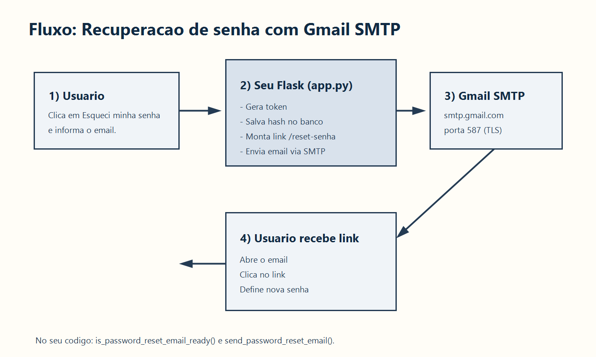
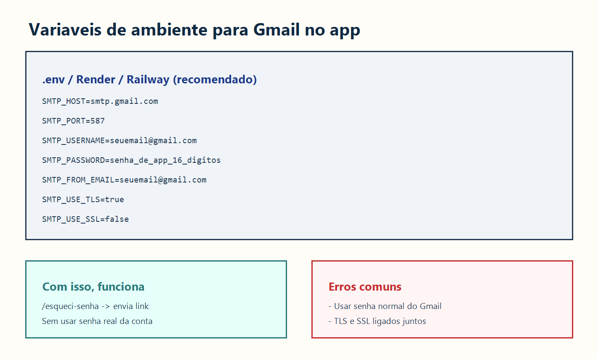
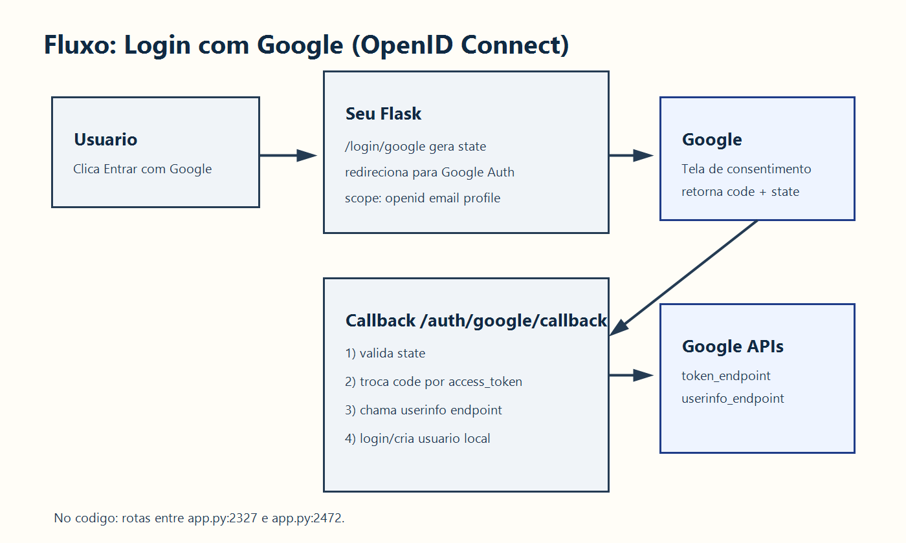

# Guia rapido: Gmail SMTP + Login Google no seu app

Este projeto ja tem as funcionalidades prontas no backend:

- Recuperacao de senha por email (SMTP): `app.py:206-262` e `app.py:2109-2184`
- Login com Google (OpenID Connect): `app.py:2327-2472`
- Botao no login so aparece quando Google estiver configurado: `templates/login.html:41-45`

## Diagramas (imagens)





---

## 1) Configurar Gmail SMTP (recuperacao de senha)

### 1.1 No Google

1. Ative verificacao em 2 etapas na conta Gmail.
2. Gere uma App Password (senha de app) de 16 digitos.
3. Guarde essa senha para `SMTP_PASSWORD`.

### 1.2 Variaveis de ambiente

Use estes valores:

```env
SMTP_HOST=smtp.gmail.com
SMTP_PORT=587
SMTP_USERNAME=seuemail@gmail.com
SMTP_PASSWORD=sua_senha_de_app_16_digitos
SMTP_FROM_EMAIL=seuemail@gmail.com
SMTP_USE_TLS=true
SMTP_USE_SSL=false
```

### 1.3 Como testar

1. Rode o app com as variaveis.
2. Abra `/esqueci-senha`.
3. Informe um email cadastrado e ativo.
4. Verifique se o email chegou com link para `/reset-senha`.

Se falhar, procure no log: `Falha ao enviar email de redefinicao`.

---

## 2) Configurar Login com Google

### 2.1 No Google Cloud Console

1. Crie (ou use) um projeto.
2. Configure OAuth consent screen.
3. Crie um OAuth Client ID do tipo **Web application**.
4. Adicione Redirect URIs:
   - `http://localhost:5000/auth/google/callback`
   - `https://SEU_DOMINIO/auth/google/callback`

### 2.2 Variaveis de ambiente

```env
GOOGLE_CLIENT_ID=...
GOOGLE_CLIENT_SECRET=...
```

Com essas duas variaveis, `is_google_auth_enabled()` vira `true` e o botao "Entrar com Google" aparece na tela de login.

### 2.3 Como testar

1. Clique em "Entrar com Google".
2. Autorize na conta Google.
3. O callback valida `state`, troca `code` por token e busca perfil.
4. O usuario e criado/atualizado no banco e logado.

---

## 3) Erros comuns

- `535 5.7.8 Username and Password not accepted` -> senha de app errada ou 2FA desligado.
- Timeout SMTP -> porta/rede/firewall.
- `redirect_uri_mismatch` -> URI no Google Cloud diferente da URI real do app.
- "Login Google nao configurado" -> faltou `GOOGLE_CLIENT_ID` ou `GOOGLE_CLIENT_SECRET`.

---

## 4) Seguranca (importante antes de producao)

No seu `app.py`, existem defaults sensiveis para admin master (`MASTER_ADMIN_EMAIL` e `MASTER_ADMIN_PASSWORD`) em `app.py:76-81`.

Recomendado:

- Definir via variaveis de ambiente com valores fortes.
- Nao deixar senha padrao no codigo.
